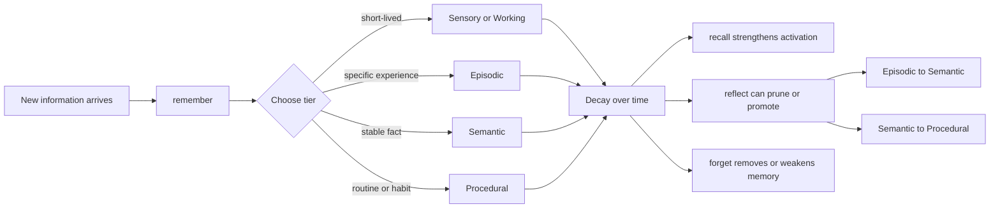

# CogniMem Server

CogniMem is a local MCP server in Rust that gives coding agents a persistent cognitive memory layer.

Instead of treating every request as stateless, an MCP client can use CogniMem to store facts, preferences, patterns, architectural decisions, and task context, then retrieve them later through structured memory operations.

It is designed for local-first use with MCP-compatible coding tools such as OpenCode, and includes an OpenCode plugin for deep integration.

## Why This Exists

LLM agents are good at short-horizon reasoning, but they usually have weak memory across sessions unless you manually restate context. CogniMem addresses that by introducing a memory system with:

- persistence across sessions
- different memory tiers with different decay behavior
- associative links between memories
- relevance-based recall with SLM reranking
- background forgetting and pruning
- explicit reflection and promotion of durable knowledge
- code graph understanding via tree-sitter
- procedural skills with WASM execution
- dreaming/consolidation cycles

This makes the agent behave less like a stateless text generator and more like a system with working context, long-term knowledge, and recall paths.

## What CogniMem Does

CogniMem currently provides:

- MCP tools for `remember`, `recall`, `associate`, `forget`, and `reflect`
- MCP resources for reading memories through `memory://...` URIs
- five memory tiers:
  - `sensory`
  - `working`
  - `episodic`
  - `semantic`
  - `procedural`
- activation-based recall with SLM reranking
- multi-hop spreading activation over associations
- bounded working-memory style capacity for `sensory` and `working`
- RocksDB persistence or an in-memory backend
- Prometheus-style metrics over HTTP
- Code graph discovery and querying
- Procedural skills with WASM execution
- Dreaming/consolidation cycles

## Mental Model

Think of the server as a graph of memory nodes.

Each memory has:

- an ID
- content
- a tier
- metadata such as activation, access count, timestamps, and decay rate
- optional associations to other memories

When the client asks to recall something, the server:

1. finds memories matching the query
2. filters by tier and activation threshold if requested
3. sorts by relevance/activation behavior in the current implementation
4. expands outward through associations using spreading activation
5. updates activation on recalled memories

Over time, memory activation decays. Low-activation memories in the more transient tiers can be pruned.

## Memory Lifecycle

The typical lifecycle of a memory in CogniMem looks like this:



This is useful for understanding that CogniMem is not only a key-value store. A memory can strengthen through reuse, weaken through disuse, become connected to other memories, and eventually be pruned or promoted.

## Memory Tiers

The five tiers are intended to model different kinds of memory.

### Sensory

- fastest decay
- lowest durability
- bounded capacity
- useful for very short-lived observations

Example use:
- a one-off tool result
- a transient file path
- a temporary user instruction for the current subtask

### Working

- still temporary, but more stable than sensory
- bounded capacity
- useful for active task context

Example use:
- the current bug being investigated
- the current branch strategy
- the file or subsystem currently being edited

### Episodic

- default tier
- stores specific events, decisions, and experiences

Example use:
- “we fixed the slotmap removal bug by replacing petgraph”
- “the user asked us not to push remote changes”

### Semantic

- durable generalized knowledge
- good for reusable facts and stable conventions

Example use:
- “this project uses RocksDB for persistence”
- “the team prefers camelCase in examples”

### Procedural

- most durable tier
- intended for learned routines and stable ways of doing things

Example use:
- “when adding features, run clippy, tests, and release build”
- “for OpenCode MCP config, use `mcp` with `type: local` and `command` array”

### Choosing the Right Tier

Use this table when deciding where new information should go.

| If the information is... | Recommended tier | Why |
|---|---|---|
| A one-off observation for the current step | `sensory` | It should disappear quickly if unused |
| Active task context needed for the current work session | `working` | It matters now, but may not matter later |
| A specific event, decision, or prior incident | `episodic` | It captures a concrete experience |
| A reusable fact, project convention, or stable preference | `semantic` | It should remain available across future sessions |
| A durable workflow, practice, or standard operating pattern | `procedural` | It represents how work should be done |

Quick rule of thumb:

- use `working` for what the agent is doing now
- use `episodic` for what happened
- use `semantic` for what is true
- use `procedural` for how to do things

## Activation, Decay, and Reflection

CogniMem is built around the idea that memories should not all be equally strong forever.

### Activation

Each memory has a `base_activation` value that changes over time.

Activation is influenced by:

- how often the memory has been accessed
- how recently it was accessed
- the tier-specific decay rate

When a memory is recalled, its metadata is updated and its activation is strengthened.

### Decay

The server runs a background decay task on a configurable interval.

That task:

- decays memory activation values
- prunes weak memories below a threshold in transient tiers

This prevents the graph from becoming a permanent dump of stale context.

### Reflection

The `reflect` tool lets the client trigger a deliberate consolidation cycle.

In the current implementation, reflection can:

- decay all memories
- prune weak memories when using full intensity
- promote stronger memories across tiers

Current promotion rules:

- `episodic -> semantic` when activation is above `0.8`
- `semantic -> procedural` when activation is above `0.9`

This gives the server a way to turn repeated or high-value experiences into more durable knowledge.

## Associations and Spreading Activation

Memories can be linked with weighted associations.

This is important because memory retrieval is often not just keyword search. Sometimes the most useful memory is connected to the directly matched one.

Current behavior:

- associations have a strength value
- recall expands across associations using multi-hop spreading activation
- expansion uses BFS-style traversal
- current defaults are:
  - max depth: `3`
  - decay factor: `0.5`
  - minimum propagated strength: `0.1`

This lets the server recall related ideas, not just exact direct hits.

## Capacity Limits

Two tiers are intentionally bounded:

- `sensory`: capacity `50`
- `working`: capacity `200`

When those tiers are full and a new memory is added:

- the lowest-activation memory in that tier is evicted

This models the idea that short-term memory is finite and should make room for what is currently most useful.

## MCP Surface

CogniMem exposes both tools and resources.

### Tools

#### `remember`

Stores a new memory.

Inputs:

- `content: string`
- `tier?: sensory | working | episodic | semantic | procedural`
- `importance?: number`
- `associations?: uuid[]`

Use this when the agent should preserve information for later use.

#### `recall`

Retrieves memories relevant to a query.

Inputs:

- `query: string`
- `tier?: memory tier`
- `limit?: integer`
- `min_activation?: number`

Use this when the agent needs prior context, preferences, decisions, or prior work.

#### `associate`

Creates a weighted link between two memories.

Inputs:

- `from: uuid`
- `to: uuid`
- `strength?: number`

Use this when two facts or experiences should influence recall together.

#### `forget`

Deletes or weakens a memory.

Inputs:

- `memory_id: uuid`
- `hard_delete?: boolean`

Behavior:

- hard delete removes the memory from the graph and storage
- soft delete lowers activation close to zero so it can be pruned naturally

#### `reflect`

Runs a consolidation cycle.

Inputs:

- `intensity?: light | full`

Behavior:

- `light`: decay and consolidation behavior
- `full`: decay, prune, and promote

### Resources

CogniMem also supports MCP resources.

Resource URI format:

```text
memory://<tier>/<uuid>
```

Example:

```text
memory://semantic/123e4567-e89b-12d3-a456-426614174000
```

This lets clients read full memory records as resources, not only via tools.

## Build

Build a release binary:

```bash
cargo build --release
```

The binary will be at `target/release/cognimem-server`.

### Installation Scripts

The project includes installation scripts supporting multiple methods:

```bash
# Direct install to ~/.local/bin
./scripts/install.sh

# Homebrew tap (requires Homebrew)
./scripts/install.sh --brew

# Docker
./scripts/install.sh --docker
```

### Homebrew Tap

You can also install via Homebrew:

```bash
brew tap cognimem/home-cognimem
brew install cognimem-server
```

## Running the Server

Default run:

```bash
cognimem-server
```

Example with explicit options:

```bash
cognimem-server \
  --data-path /path/to/cognimem-data \
  --decay-interval-secs 300 \
  --prune-threshold 0.01 \
  --storage rocksdb \
  --metrics-port 9090
```

### CLI Options

- `--data-path <PATH>`: RocksDB storage path
- `--decay-interval-secs <SECONDS>`: background decay interval
- `--prune-threshold <FLOAT>`: prune memories below this activation threshold
- `--storage <rocksdb|memory>`: choose backend
- `--metrics-port <PORT>`: metrics HTTP port

## Storage Backends

### RocksDB

Default backend.

Use when you want persistence across runs.

```bash
cognimem-server --storage rocksdb --data-path /path/to/cognimem-data
```

### In-memory

Ephemeral backend.

Use when you want isolated tests or temporary sessions.

```bash
cognimem-server --storage memory
```

## OpenCode Integration

OpenCode uses the `mcp` section in `opencode.json`.

Adjust the example paths below to match your machine.

### OpenCode Plugin (Recommended)

The project includes an OpenCode plugin for deep integration with event hooks and custom tools.

Install the plugin:

```bash
# Project-level
cp -r opencode-plugin .opencode/plugins/cognimem

# Or global
cp -r opencode-plugin ~/.config/opencode/plugins/cognimem
```

Add to your `opencode.json`:

```json
{
  "$schema": "https://opencode.ai/config.json",
  "plugin": ["cognimem-opencode-plugin"]
}
```

#### Plugin Features

- Event hooks: `session.idle`, `session.created`, `experimental.session.compacting`
- Custom tools:
  - `cognimem_recall` - Recall memories
  - `cognimem_inject` - Inject new memory
  - `cognimem_search` - Search codebase
  - `cognimem_consolidate` - Run consolidation
  - `cognimem_dream` - Trigger dreaming
  - `cognimem_discover` - Discover code graph
  - `cognimem_imagine` - Imagine scenarios

### MCP Server

Alternatively, use the MCP server directly:

### Example Using Binary Name from PATH

```json
{
  "$schema": "https://opencode.ai/config.json",
  "mcp": {
    "cognimem": {
      "type": "local",
      "command": [
        "cognimem-server",
        "--data-path",
        "/path/to/cognimem-data",
        "--decay-interval-secs",
        "300",
        "--metrics-port",
        "9090"
      ],
      "enabled": true,
      "timeout": 5000
    }
  }
}
```

### Example Using Absolute Binary Path

Use this if your OpenCode process does not inherit the same `PATH` as your shell.

```json
{
  "$schema": "https://opencode.ai/config.json",
  "mcp": {
    "cognimem": {
      "type": "local",
      "command": [
        "/absolute/path/to/cognimem-server",
        "--data-path",
        "/path/to/cognimem-data",
        "--decay-interval-secs",
        "300",
        "--metrics-port",
        "9090"
      ],
      "enabled": true,
      "timeout": 5000
    }
  }
}
```

### Why `command` Is an Array

OpenCode's MCP config expects the local command as an array.

That means:

- first element is the executable
- following elements are arguments

This is correct:

```json
"command": ["cognimem-server", "--metrics-port", "9090"]
```

This is not the intended shape:

```json
"command": "cognimem-server --metrics-port 9090"
```

## Verifying OpenCode Integration

### 1. Confirm OpenCode Can See the Server

```bash
opencode mcp list
```

Expected output should include something like:

```text
cognimem connected
```

### 2. Perform a Real Tool Flow

In OpenCode, try:

```text
use cognimem to remember that the project uses RocksDB
```

Then:

```text
use cognimem to recall what storage the project uses
```

If both succeed, the end-to-end MCP path is working.

### 3. Verify Metrics

If you started the server with `--metrics-port 9090`:

```bash
curl http://127.0.0.1:9090
```

You should see metrics such as:

```text
# HELP cognimem_memory_count Total number of memories
# TYPE cognimem_memory_count gauge
cognimem_memory_count 1
```

## Metrics

CogniMem exposes a lightweight Prometheus-style text endpoint over HTTP.

Current metrics:

- `cognimem_memory_count`
- `cognimem_remember_total`
- `cognimem_recall_total`
- `cognimem_forget_total`
- `cognimem_reflect_total`
- `cognimem_prune_total`
- `cognimem_associate_total`

These are useful for checking:

- whether the memory graph is growing as expected
- whether recall is being exercised
- whether forget/reflect operations are actually happening
- whether pruning is too aggressive or too weak

## Architecture Overview

At a high level, the implementation is split into a few core pieces.

### `src/main.rs`

Contains:

- the MCP server implementation
- tool handlers
- resource handlers
- metrics HTTP listener
- background decay task
- capture server
- dashboard server

### `src/memory/graph.rs`

Contains the memory graph implementation.

Important details:

- uses `slotmap` for stable internal keys
- tracks memory IDs separately
- stores association edges
- stores tier indexes for faster filtered recall
- vector embeddings for semantic search

### `src/memory/decay.rs`

Contains:

- decay logic
- pruning logic
- promotion logic used by reflection

### `src/memory/codegraph.rs`

Contains code graph implementation:

- tree-sitter parsing for Rust and Python
- CodeNode and CodeRelation types
- discovers functions, structs, traits, imports
- supports multi-language parsing

### `src/memory/skill.rs`

Contains procedural skills:

- skill detection from repeated patterns
- WASM execution via wasmtime
- Self-optimization based on accuracy

### `src/memory/dream.rs`

Contains dreaming/consolidation:

- SLM-powered dream generation
- C3GAN generative replay
- consolidation cycles

### `src/security/`

Contains security module:

- AES-256-GCM encryption
- bcrypt password hashing
- AuthMiddleware

### `src/dashboard/`

Contains web dashboard:

- HTMX-powered UI
- centralized theme system
- memory and code graph views

### `src/capture/`

Contains capture pipeline:

- CanonicalEvent handling
- aggregation pipeline
- ingest server

## Example Memory Workflows

### Store a Stable Preference

Use semantic memory for a stable preference:

```text
use cognimem to remember that the user prefers concise commit messages, tier semantic, importance 0.9
```

Later:

```text
use cognimem to recall the user's commit message preference
```

### Store Task Context

Use working memory for active task state:

```text
use cognimem to remember that we are debugging metrics on port 9090, tier working
```

### Link Related Memories

If a client keeps the returned IDs, it can associate them:

- architecture decision memory
- implementation detail memory

This improves future recall of related concepts.

### Consolidate Important Knowledge

After enough useful work has accumulated:

```text
use cognimem to reflect with full intensity
```

That gives the server a chance to prune weaker transient memories and promote stronger durable ones.

## When Not to Store Memory

More memory is not always better. Storing everything creates noise and makes recall less useful. In general, do not store information that is trivial, disposable, or risky.

Avoid storing these unless there is a specific reason:

- secrets, API keys, tokens, passwords, or credentials
- very noisy raw outputs that can be regenerated easily
- highly repetitive low-value observations
- temporary details that only matter for a single command and will never be useful again
- large blobs of text when a concise summary would be better
- stale assumptions that have not been verified

Examples of poor memory candidates:

- a full dependency install log
- a random temporary filename from one shell command
- a complete build output when the only important part is one failing error
- secret material from `.env` or auth headers

A better pattern is:

- store the stable conclusion, not the entire raw transcript
- store the decision, not every intermediate thought
- store the reusable lesson, not every transient observation

Good example:

- “The project uses RocksDB for persistence”

Bad example:

- “At 10:13 PM the server printed 147 lines during startup and line 83 mentioned RocksDB”

If in doubt, ask:

1. Will this still matter later?
2. Is this reusable knowledge or just temporary noise?
3. Can this be summarized more cleanly?

## End-to-End Status

The server has been tested end-to-end against the live MCP protocol over stdio.

Verified flows:

- initialize
- tools list
- remember
- recall
- associate
- forget
- reflect
- resources list
- resources read
- metrics verification

## Development

Run checks locally:

```bash
cargo clippy -- -D warnings
cargo test
cargo build --release
```

## Security

The server includes optional security features.

### CLI Options

```bash
cognimem-server \
  --require-auth \
  --password "your-password" \
  --tls-cert /path/to/cert.pem \
  --tls-key /path/to/key.pem
```

### Encryption

Data can be encrypted at rest using AES-256-GCM.

### Authentication

Optional password-based authentication for MCP requests.

### TLS

TLS support requires a proxy (nginx, caddy) in front:

```bash
# Use nginx or caddy for TLS termination
cognimem-server --data-path /path/to/data
```

## Troubleshooting

### OpenCode says the server is not connected

Check:

- the binary exists
- the binary is on `PATH` or you used an absolute path
- the `command` field is an array
- the config JSON is valid

Useful checks:

```bash
which cognimem-server
opencode mcp list
```

### MCP works but metrics do not

Remember that MCP traffic uses stdio, while metrics use a separate HTTP listener.

Check:

- `--metrics-port` is set
- nothing else is using that port
- you are curling the correct port

Example:

```bash
curl http://127.0.0.1:9090
```

### Memories disappear faster than expected

Check:

- `--decay-interval-secs`
- `--prune-threshold`
- whether the memories are being stored in transient tiers

If you need longer retention, use `episodic`, `semantic`, or `procedural` for the right kinds of information.

## Notes

- MCP communication is over stdio
- metrics are separate HTTP traffic on `--metrics-port`
- using `cognimem-server` directly in OpenCode config is fine if it is on `PATH`
- if you want deterministic startup in GUI-launched environments, prefer the absolute binary path in config
